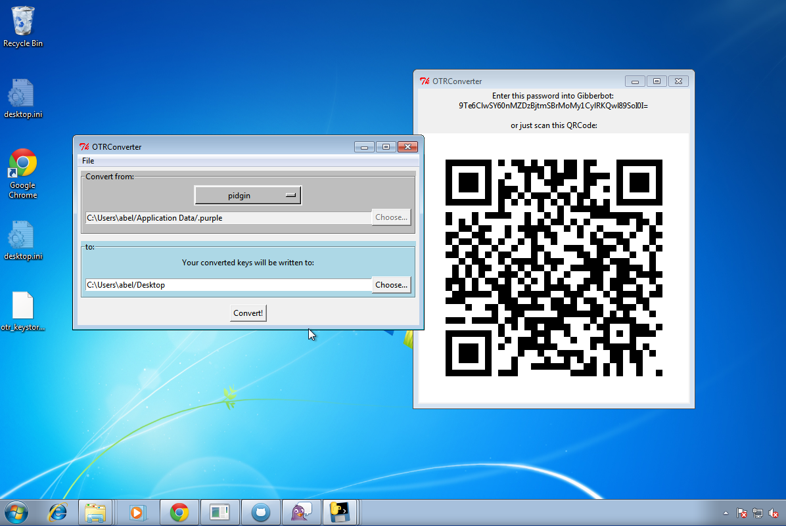

# Building On Windows

Either a Windows machine or a Linux box with wine installed will do to produce a w32 binary.



## Download Prerequisites 

**Automatic Download** (Recommended) 

1. Execute the`fetch-and-verify.sh` script
3. Copy all the files to your windows computer
4. Download the [VS 2008 redistributable][vsredist]

**Manual Download**

* [Git][git]
* [Python 2.7][py27] ([sig][pysig])
* [Python Windows 32 Bindings][pywin32]
* [PyInstaller Development Version][pyinst]
* [Setuptools Bootstrap][setuptools]
* [MingW Installer][mingw]
* [OpenSSL-Win32][openssl]
* [MS VS 2008 redistributable][vsredist]
* [PyCrypto Source][pycrypto] ([sig][pycryptosig])
* [Pure Python OTR Source][potr]
* [Pidgin][pidgin] ([sig][pidginsig])
* [Pidgin OTR Plugin][pidgin-otr] ([sig][pidgin-otrsig])

**Builds on Linux**

Install wine:

* Debian/Ubuntu: `sudo apt-get install wine`
* Fedora: `sudo yum install wine`


## Install Prerequisites

### MingW

1. Execute the installer
2. Follow the wizard
3. When prompted in the installer choose this options:

```
    C compiler
    C++ compiler
    Msys basic system
    MinGW Developer Toolkit
```

### Git

1. Execute the installer
2. Choose to add git to the PATH

### OpenSSL

1. Execute the vcredist_x86.exe package
2. Install it completely
3. Execute the OpenSSL installer
4. When prompted choose "Copy OpenSSL DLLs to:  The OpenSSL binaries (/bin) directory"

### Python

1. Execute the Python installer, use default options
    * Linux+Wine: you must use `msiexec /i python-2.7.5.msi`

## Post Python Install Configuration

**Configure the PATH environment variable**

Windows:

1. Right-click on My Computer and select properties
2. Go to the 'Advanced' section and select 'Environment variables'
3. Select 'Path' from the 'System Variables' and click the 'Edit button'
4. Append the following to your PATH variable:

    ```
    C:\MinGW\bin;C:\MinGW\msys\1.0\bin;C:\Python27;C:\Python27\Scripts;C:\OpenSSL-Win32\bin;
    ```

Linux+Wine:

1. Open regedit using the `regedit` command
2. Edit `HKEY_CURRENT_USER/Environment`
3. Add a new String value called `PATH` using the value above

**Set Python to use MinGW**

1. Create the following file: C:\Python27\Lib\distutils\distutils.cfg
2. Append:

```
    [build]
    compiler=mingw32
```
3. Save and close

**Fix -mno-cygwin error**

To prevent the following error when building Python modules, we must edit a distutils file.

    gcc: error: unrecognized command line option '-mno-cygwin'

1. Edit the file `C:\Python27\Lib\distutils\cygwinccompiler.py`
2. Look for the class: `Mingw32CCompiler` around line 297
3. Find the block that beings with 'self.set_executables('
4. Delete all the '-mno-cygwin' flags
5. Save and close


## Install Python Dependencies

Note: your $HOME when using MinGW shell is in C:\MinGW\msys\1.0\home\USERNAME

### setuptools

1. Open your MinGW Shell
    * Windows: Start -> MinGW -> MinGW Shell
    * Linux+Wine: `wine cmd.exe /C C:\MinGW/msys/1.0/msys.bat`
2. cd to where you downloaded [ez_setup.py][setuptools]
    * Windows: Access the normal windows FS using the /c/ path (i.e., /c/ corresponds to C:\)
    * Linux+Wine: Access your native root fs with /z/
3. Execute:

```bash
    python ez_setup.py
```

### Python W32 Bindings

1. Execute the Python installer, use default options

*Note*: If using a virtual environment (virtualenv), then you must open a
command shell that has your virtualenv activated and execute:

    easy_install /c/path/to/pywin32-218.win32-py2.7.exe

Otherwise pywin32 will be installed into the system site-packages dir, and not
be available to your virtualenv.


### PyCrypto

For some reason we must install PyCrypto this way, instead of relying on it to
be installed via setup.py along with the rest of the dependencies.

1. cd to your extracted pycrypto dir: `cd pycrypto-2.6`
2. `python seutp.py install`


### KeySync

1. `cd keysync`
2. `python setup.py install`

This will download, compile, and install all the remaining python modules.

## Verify Everything Works

At this point, all the dependencies for keysync should be installed
and functioning, so keysync should work. You can test it by running keysync-gui:

You'll probably want to install Pidgin, pidgin-otr, and configure an account
before running keysync.

```bash
cd keysync
python keysync-gui
```
Do not proceed unless the GUI pops up and the app functions as expected.

## Create Windows Executable with PyInstaller

Note: Due to [bug 651](http://www.pyinstaller.org/ticket/651) the development
version of PyInstaller must be used.

KeySync's setup.py script automatically installs pyinstaller, so all you need
to do is execute pyinstaller and point it at the script you want to turn into
an EXE.  Build the package:

```bash
pyinstaller --onefile keysync-gui.spec
```

You can omit the `--onefile` parameter, see the [PyInstaller
Manual](http://htmlpreview.github.io/?https://github.com/pyinstaller/pyinstaller/blob/develop/doc/Manual.html)
for what exactly the consequences of both modes are.

If the process succeeds, then check the `dist/` directory
inside the pyinstaller directory.

# Security Considerations

Unfortunately most of the dependencies and toolchain used above are not
available to download over HTTPS nor do they have signatures to verify. Even
MinGW lacks any sort of secure download, so securely building the dependencies from
source may not be possible.

Also, according to [this ticket](http://sourceforge.net/p/pywin32/bugs/519/)
the Python Win32 bindings are not easily buildable with MinGW.

[git]: http://git-scm.com/download/win
[py27]: http://www.python.org/ftp/python/2.7.5/python-2.7.5.msi
[pysig]: http://www.python.org/ftp/python/2.7.5/python-2.7.5.msi.asc
[pywin32]: http://downloads.sourceforge.net/project/pywin32/pywin32/Build%20218/pywin32-218.win32-py2.7.exe?r=http%3A%2F%2Fsourceforge.net%2Fprojects%2Fpyw#
[pyinst]: https://github.com/pyinstaller/pyinstaller/tarball/develop
[setuptools]: https://bitbucket.org/pypa/setuptools/raw/bootstrap/ez_setup.py
[mingw]: http://downloads.sourceforge.net/project/mingw/Installer/mingw-get-inst/mingw-get-inst-20120426/mingw-get-inst-20120426.exe?r=&use_mirror=superb#
[openssl]: https://slproweb.com/download/Win32OpenSSL-1_0_1e.exe
[vsredist]: http://www.microsoft.com/en-us/download/details.aspx?id=29
[pycrypto]: https://pypi.python.org/packages/source/p/pycrypto/pycrypto-2.6.tar.gz#md5=88dad0a270d1fe83a39e0467a66a22bb
[pycryptosig]: https://pypi.python.org/packages/source/p/pycrypto/pycrypto-2.6.tar.gz.asc
[potr]: https://github.com/afflux/pure-python-otr/archive/1.0.0beta6.zip
[pidgin]: http://downloads.sourceforge.net/project/pidgin/Pidgin/2.10.7/pidgin-2.10.7-offline.exe?r=http%3A%2F%2Fsourceforge.net%2Fprojects%2Fpidgin%2Ffil#
[pidginsig]: http://downloads.sourceforge.net/project/pidgin/Pidgin/2.10.7/pidgin-2.10.7-offline.exe.asc?r=http%3A%2F%2Fsourceforge.net%2Fprojects%2Fpidgin%2#
[pidgin-otr]: http://www.cypherpunks.ca/otr/binaries/windows/pidgin-otr-4.0.0-1.exe
[pidgin-otrsig]: http://www.cypherpunks.ca/otr/binaries/windows/pidgin-otr-4.0.0-1.exe.asc


